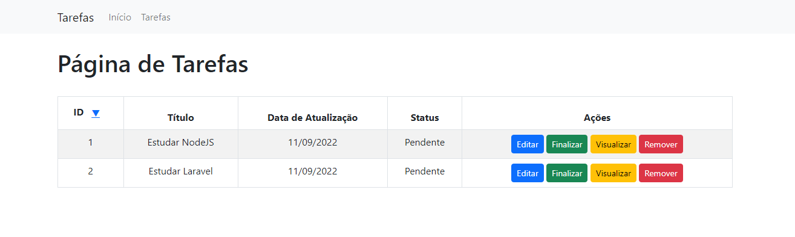

# TP02 - Programação Orientada a Objetos II

## Desenvolver uma pagina web para consumir a api de Tasks feita em aula.

### Requisitos
* A pagina deve conter um navbar.
* A pagina deve consultar as tasks disponiveis no banco de dados pela api e exibir em uma tabela.
* Deve ser possivel ordenar a tabela por id.
* A tabela deve conter quatro botões (Editar, Finalizar, Visualizar e Remover).
### Resultado:
